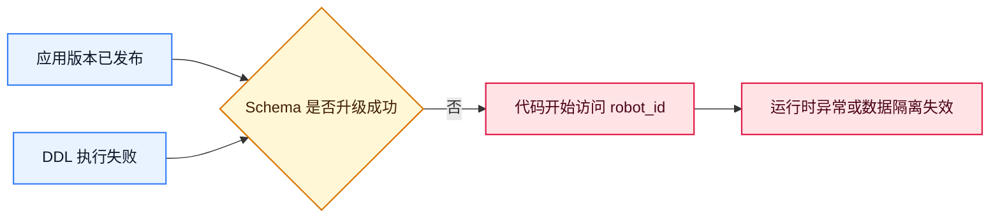
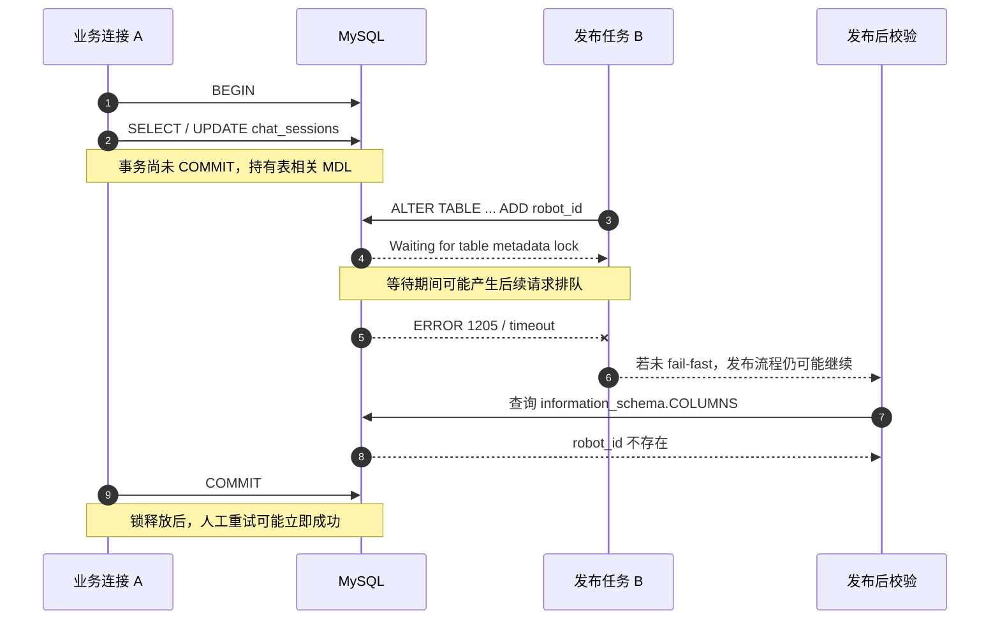
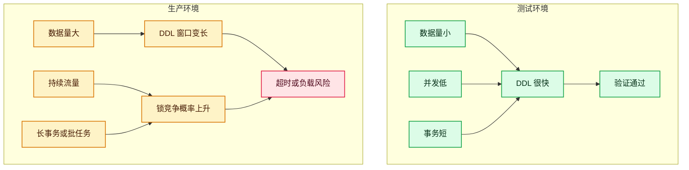
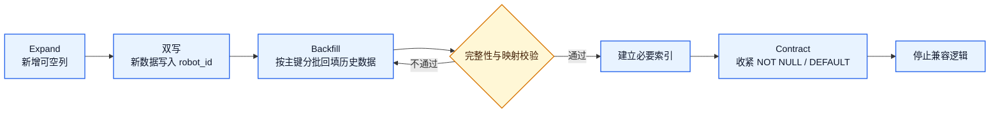
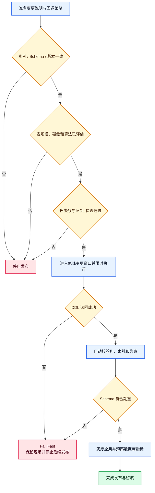

> 一条普通的 `ADD COLUMN` 在测试环境顺利执行，到了生产环境却留下了一个危险的中间状态：应用已经发布，`robot_id` 字段没有创建。日志中唯一明确的线索是 `ERROR 1205 (HY000): Lock wait timeout exceeded`。

## TL;DR

| 维度 | 结论 |
| --- | --- |
| 故障表现 | 生产发布后，`chat_sessions`、`chat_runs`、`chat_messages` 未按预期新增 `robot_id` |
| 直接原因 | `ALTER TABLE` 等待锁超时并失败；发布流程没有阻止应用继续上线或没有充分暴露失败状态 |
| 首要根因假设 | 目标表被活跃事务持有 Metadata Lock（MDL），DDL 无法取得所需的排他元数据锁 |
| 已排除方向 | SQL 基础语法错误不是主因；同类 `ADD COLUMN` 语法在常见 MySQL 5.7/8.0 中均受支持 |
| 版本差异 | 可能改变 DDL 算法、是否重建表、执行时间和竞争窗口，是放大因素而非语法层面的直接根因 |
| 证据边界 | 由于故障现场的阻塞会话未被完整保留，不能事后武断地认定某一个具体事务就是 blocker |
| 核心改进 | 发布前查长事务和 MDL；显式评估 DDL 算法；失败即停止；发布后自动校验 Schema；大表采用分阶段变更或在线 Schema 变更工具 |

一句话总结：

> **相同 SQL 在另一个时间执行成功，只能证明 SQL 能执行，不能证明它在生产流量下可以安全执行。**

## 1. 事故背景

为了支持机器人维度的数据隔离，需要为三张业务表新增 `robot_id`，并增加相关索引。核心变更类似：

```sql
ALTER TABLE chat_sessions
ADD COLUMN robot_id VARCHAR(64)
NOT NULL DEFAULT 'data-agent'
COMMENT '机器人ID（用于数据隔离）'
AFTER id;
```

同一脚本在测试环境和人工验证中均能执行成功，但生产发布后检查发现字段不存在。发布日志给出了关键错误：

```text
ERROR 1205 (HY000) at line 4 in file update.sql:
Lock wait timeout exceeded; try restarting transaction
```

这类事故的危险之处不只是“一条 SQL 失败”，而是系统进入了 Schema 与应用版本不一致的状态：



## 2. 影响与风险

本次已确认的影响是数据库字段未按计划创建。即使业务暂时没有立即报错，也存在以下风险：

- 新代码查询或写入 `robot_id` 时出现 `Unknown column`；
- 应用发布“成功”掩盖数据库迁移失败，造成错误的完成认知；
- 多张表处于不一致的迁移状态，重试时又可能遇到重复字段或重复索引；
- 若 `robot_id` 用于租户或机器人数据隔离，错误默认值和错误回填可能扩大为数据边界问题；
- 人工补执行虽然恢复了 Schema，却可能让真正的锁竞争和发布机制缺陷继续潜伏。

## 3. 先区分事实、推断与待验证项

生产复盘最容易犯的错误，是把“合理解释”写成“已经证实的根因”。本次证据应这样分层：

| 类型 | 内容 | 结论强度 |
| --- | --- | --- |
| 已确认事实 | 生产缺少 `robot_id`；日志出现 `ERROR 1205`；同一 SQL 后续可以成功执行 | 强 |
| 高概率推断 | DDL 执行时遇到锁竞争；对 `ALTER TABLE` 而言，MDL 是第一排查方向 | 中到强 |
| 可能的放大因素 | 长事务、高并发、大表、MySQL 版本差异、`AFTER` 触发表重建、发布超时 | 中 |
| 尚未证实 | 哪个连接、哪条 SQL、哪一个任务持有了阻塞锁 | 弱，需现场证据 |
| 不支持的结论 | “MySQL 5.7 不支持这条 ADD COLUMN 语法” | 可排除 |

因此，严谨的根因表述是：

> **直接原因已经确认：生产 `ALTER TABLE` 因锁等待超时失败。结合 DDL 的锁语义，最可能的阻塞机制是 Metadata Lock；但由于未保存等待时的会话和锁关系，具体 blocker 无法事后唯一确定。**

## 4. 调研方法：从静态正确性转向运行时状态

排查数据库变更时，可以先将问题分成两类：

| 静态问题 | 动态问题 |
| --- | --- |
| SQL 语法错误 | Metadata Lock 竞争 |
| 字段或索引已经存在 | 长事务或空闲未提交事务 |
| 依赖字段不存在 | 高并发与排队效应 |
| 账号没有 `ALTER` 权限 | 大表重建、I/O 或临时空间压力 |
| 连错实例、Schema 或只读副本 | 发布平台或代理超时、主动终止 SQL |
| Migration 版本被跳过 | DDL 算法与生产负载不匹配 |

`ERROR 1205` 已经把排查重点从“SQL 写得对不对”转移到“执行 SQL 的那一刻数据库发生了什么”。但在进入锁分析前，仍要快速排除连错库、权限、只读和迁移历史等常见问题。

### 4.1 确认连接目标与版本

在发布连接和人工检查连接上分别执行：

```sql
SELECT
    DATABASE() AS db_name,
    @@hostname AS hostname,
    @@port AS port,
    @@server_uuid AS server_uuid,
    VERSION() AS mysql_version,
    @@version_comment AS version_comment;
```

需要逐项比对 `DATABASE()`、主机、端口和 `server_uuid`。同名 Schema、主从读写分离、代理路由和多集群配置，都可能制造“日志显示执行过，但检查不到字段”的错觉。

### 4.2 确认账号、权限与只读状态

```sql
SELECT USER() AS login_identity, CURRENT_USER() AS privilege_identity;

SHOW GRANTS FOR CURRENT_USER();

SELECT
    @@read_only AS read_only,
    @@super_read_only AS super_read_only;
```

不要只看整个发布任务的绿色状态，要查看数据库客户端的原始错误和最终退出码。

### 4.3 确认实际 Schema 与迁移历史

```sql
SHOW CREATE TABLE chat_sessions;
SHOW CREATE TABLE chat_runs;
SHOW CREATE TABLE chat_messages;

SELECT
    TABLE_NAME,
    COLUMN_NAME,
    COLUMN_TYPE,
    IS_NULLABLE,
    COLUMN_DEFAULT
FROM information_schema.COLUMNS
WHERE TABLE_SCHEMA = DATABASE()
  AND TABLE_NAME IN ('chat_sessions', 'chat_runs', 'chat_messages')
  AND COLUMN_NAME = 'robot_id';
```

如果使用 Flyway、Liquibase 或自研 Migration 框架，还要检查版本表。一个典型反模式是修改已在生产执行过的旧 migration：新环境会执行新内容，生产却会根据历史记录跳过它。

## 5. Metadata Lock 如何让 ALTER TABLE 失败

MySQL 使用 Metadata Lock 保证对象定义与并发访问的一致性。事务访问表后，相关元数据锁可能保持到事务提交或回滚；`ALTER TABLE` 则需要取得与结构变更相适配的排他锁。



这解释了为什么“自动发布失败、稍后人工执行成功”并不矛盾：

- SQL 没变；
- Schema 没变；
- 变化的是执行时刻的事务和锁状态。

还要注意排队效应：一个等待排他 MDL 的 DDL 可能让后续访问同一张表的请求也排队，从单条 DDL 等待放大为业务连接堆积。因此，DDL 卡住时不应无限等待。

## 6. 如何在现场定位谁阻塞了谁

锁问题高度依赖现场。最有价值的动作不是“取消后晚点重试”，而是在风险可控的前提下先保留证据。

### 6.1 快速查看会话状态

```sql
SHOW FULL PROCESSLIST;
```

重点关注：

```text
Waiting for table metadata lock
```

同时记录连接 ID、用户、来源地址、数据库、等待时间和 SQL。

### 6.2 查看长事务

```sql
SELECT
    trx_id,
    trx_mysql_thread_id,
    trx_started,
    trx_state,
    trx_rows_locked,
    trx_rows_modified,
    trx_query
FROM information_schema.innodb_trx
ORDER BY trx_started;
```

`trx_query IS NULL` 不代表事务没有风险。连接可能处于 `Sleep`，但事务仍未提交；这正是“空闲事务持锁”最隐蔽的形态之一。

### 6.3 直接查看表锁等待关系

若 `sys` Schema 可用：

```sql
SELECT
    object_schema,
    object_name,
    waiting_pid,
    waiting_query,
    waiting_query_secs,
    blocking_pid,
    blocking_account,
    sql_kill_blocking_connection
FROM sys.schema_table_lock_waits
WHERE object_schema = DATABASE()
  AND object_name IN ('chat_sessions', 'chat_runs', 'chat_messages');
```

`sql_kill_blocking_connection` 只是辅助信息，不能看到就直接执行。终止生产连接前，必须确认事务内容、回滚成本、业务影响和当班授权。

### 6.4 查看 Performance Schema 中的 MDL

```sql
SELECT
    ml.OBJECT_TYPE,
    ml.OBJECT_SCHEMA,
    ml.OBJECT_NAME,
    ml.LOCK_TYPE,
    ml.LOCK_DURATION,
    ml.LOCK_STATUS,
    t.PROCESSLIST_ID,
    t.PROCESSLIST_USER,
    t.PROCESSLIST_HOST,
    t.PROCESSLIST_TIME,
    t.PROCESSLIST_STATE,
    t.PROCESSLIST_INFO
FROM performance_schema.metadata_locks AS ml
LEFT JOIN performance_schema.threads AS t
       ON t.THREAD_ID = ml.OWNER_THREAD_ID
WHERE ml.OBJECT_SCHEMA = DATABASE()
  AND ml.OBJECT_NAME IN ('chat_sessions', 'chat_runs', 'chat_messages')
ORDER BY ml.OBJECT_NAME, ml.LOCK_STATUS, t.PROCESSLIST_TIME DESC;
```

通常需要同时观察 `GRANTED` 和 `PENDING`。前者是已持有的锁，后者是尚未获得的请求。

### 6.5 不要混淆两个超时参数

```sql
SHOW VARIABLES
WHERE Variable_name IN ('lock_wait_timeout', 'innodb_lock_wait_timeout');
```

| 参数 | 主要作用域 |
| --- | --- |
| `lock_wait_timeout` | Metadata Lock 等待 |
| `innodb_lock_wait_timeout` | InnoDB 行锁等待 |

两类超时都可能表现为 `ERROR 1205`，所以不能仅凭错误码断定锁类型；必须结合 SQL 类型、Processlist、`metadata_locks` 和事务信息判断。本次失败语句是 `ALTER TABLE`，因此 MDL 是首要方向。

## 7. 为什么测试环境没有发现

| 维度 | 测试环境 | 生产环境 | 风险影响 |
| --- | --- | --- | --- |
| 数据量 | 小 | 可能大几个数量级 | 表重建与索引创建耗时显著不同 |
| 并发连接 | 少且短 | 多且持续 | 更容易与 DDL 争用 MDL |
| 事务特征 | 很少有长事务 | 批任务、报表、消息消费、人工操作并存 | 锁持有时间更不可控 |
| MySQL 版本 | 可能较新 | 可能较旧 | DDL 算法和能力不同 |
| 表定义 | 常由新脚本初始化 | 经历多年演进 | 行格式、索引和依赖可能不同 |
| 发布窗口 | 随时可测 | 真实业务负载下执行 | 竞争窗口扩大 |
| 验证目标 | “SQL 能否运行” | “能否在约束内安全运行” | Functional Correctness 不等于 Operational Correctness |



## 8. MySQL 版本差异：不是语法问题，却可能放大风险

本次 `ADD COLUMN ... DEFAULT ... COMMENT ... AFTER ...` 的基础语法在常见 MySQL 5.7 和 8.0 中都成立。真正需要比较的是执行算法和代价。

| 能力 | MySQL 5.7 | MySQL 8.0 |
| --- | --- | --- |
| `ADD COLUMN` 常见算法 | 支持 `INPLACE`，但通常需要重建表 | 从 8.0.12 起，满足条件时可使用 `INSTANT` |
| 任意位置 Instant Add Column | 不支持 | 8.0.29 起在满足限制时支持 |
| 使用 `AFTER id` 的影响 | 需要重组数据 | 8.0.29 之前无法用 Instant 在任意位置新增列，可能退化为更重算法 |
| DDL 原子性 | DDL 通常隐式提交，恢复语义有限 | 8.0 数据字典支持原子 DDL 的范围更广 |

这意味着原脚本中的 `AFTER id` 虽然主要是排版需求，却可能改变执行路径。字段的物理位置通常不影响查询性能，若没有硬性兼容需求，建议去掉 `AFTER`，让数据库更有机会采用低成本算法。

不要猜测算法。应在与生产相同的小版本、表结构、行格式和索引条件下预演，并用显式算法约束阻止静默降级：

```sql
-- 仅在确认当前版本和表条件支持时采用；不支持则立即报错
ALTER TABLE chat_sessions
    ADD COLUMN robot_id VARCHAR(64) NULL,
    ALGORITHM=INSTANT;
```

若计划使用 In-place DDL：

```sql
ALTER TABLE chat_sessions
    ADD COLUMN robot_id VARCHAR(64) NULL,
    ALGORITHM=INPLACE,
    LOCK=NONE;
```

显式约束的价值在于：如果 MySQL 无法满足期望算法或并发级别，就失败并返回原因，而不是在生产中悄悄选择更昂贵的执行方式。

## 9. 更安全的 robot_id 迁移设计

直接添加：

```sql
NOT NULL DEFAULT 'data-agent'
```

会把所有无法区分来源的历史记录都解释成同一个机器人。如果 `robot_id` 承担数据隔离职责，这首先是数据语义问题，其次才是 DDL 问题。

更稳妥的是 Expand → Migrate → Contract：



关键原则：

1. 先增加可兼容的新结构，旧应用仍能工作；
2. 新应用开始双写或可靠写入 `robot_id`；
3. 按主键范围、小批次、可暂停、可重试地回填历史数据；
4. 校验空值、非法值、关联关系和各机器人数量分布；
5. 根据真实查询使用 `EXPLAIN` 验证索引；
6. 最后再收紧 `NOT NULL`、默认值和旧逻辑。

## 10. 索引设计也要随迁移一起复核

原方案包含多个以 `robot_id` 开头的索引，应根据最左前缀原则消除重复写放大：

| 表 | 候选索引 | 评估 |
| --- | --- | --- |
| `chat_sessions` | `(robot_id)` 与 `(robot_id, deleted_at)` | 后者通常可支持仅按 `robot_id` 的等值查询，单列索引可能冗余 |
| `chat_runs` | `(robot_id)` 与 `(robot_id, status)` | 后者通常覆盖 `robot_id` 左前缀，需结合排序、覆盖查询和基数判断 |
| `chat_messages` | `(robot_id)`、`(session_id, robot_id)`、`(run_id, robot_id)` | 后两个不能高效替代以 `robot_id` 为首列的查询，单列索引可能仍有价值 |

“可能冗余”不是“可以直接删除”。最终决策应基于真实 SQL、`EXPLAIN`、索引基数、写入开销和慢查询数据。

## 11. 标准化的生产 DDL 发布流程



### 11.1 发布前

- 确认目标实例、端口、`server_uuid`、Schema 和主从角色；
- 比对生产与预演环境的 MySQL 精确版本、存储引擎、行格式和表定义；
- 统计表行数、数据量、索引量和可用磁盘空间；
- 确认 DDL 算法、是否重建表、并发 DML 能力和预计耗时；
- 检查长事务、空闲未提交事务、MDL 等待、备份、报表和批任务；
- 定义最大等待时间、停止条件、观察指标和责任人；
- 对数据隔离字段确认历史数据回填规则，不能用默认值替代业务判断；
- 准备前向修复方案。删除列或回滚大表 DDL 不应被视为低成本操作。

表规模可以先用下列查询估算：

```sql
SELECT
    TABLE_NAME,
    TABLE_ROWS,
    ROUND(DATA_LENGTH / 1024 / 1024 / 1024, 2) AS data_gb,
    ROUND(INDEX_LENGTH / 1024 / 1024 / 1024, 2) AS index_gb
FROM information_schema.TABLES
WHERE TABLE_SCHEMA = DATABASE()
  AND TABLE_NAME IN ('chat_sessions', 'chat_runs', 'chat_messages');
```

`TABLE_ROWS` 对 InnoDB 通常是估算值，但足以先判断数量级。

### 11.2 发布中

- 数据库变更与应用变更建立明确依赖，DDL 未完成时不发布依赖新列的代码；
- 为等待设置有限、可观测的时间预算，避免 DDL 无限排队；
- 监控 Threads、QPS、延迟、锁等待、磁盘 I/O、复制延迟和连接池；
- 发现 `Waiting for table metadata lock` 时立即进入预案，不盲目多次重试；
- 不使用会吞掉 SQL 错误的客户端选项；确保 Migration 命令非零退出能让流水线失败；
- 大表必要时使用经过评审的在线 Schema 变更工具，并演练限流、暂停与清理流程。

### 11.3 发布后

不能把“命令执行结束”当作“变更成功”。至少自动校验：

```sql
-- 三张表必须各返回一行
SELECT
    TABLE_NAME,
    COLUMN_TYPE,
    IS_NULLABLE,
    COLUMN_DEFAULT
FROM information_schema.COLUMNS
WHERE TABLE_SCHEMA = DATABASE()
  AND TABLE_NAME IN ('chat_sessions', 'chat_runs', 'chat_messages')
  AND COLUMN_NAME = 'robot_id'
ORDER BY TABLE_NAME;
```

还应验证索引列顺序、应用读写、错误率、慢查询、复制延迟，以及历史数据的映射正确性。校验失败必须阻止发布任务被标记为成功。

## 12. 可直接复用的 Checklist

### 变更设计

- [ ] 每次变更新建 migration，不修改已发布的历史 migration
- [ ] 明确列默认值和历史数据回填语义
- [ ] 使用 Expand → Migrate → Contract 处理非兼容变更
- [ ] 删除不必要的 `AFTER` / `FIRST`，避免只为排版增加 DDL 成本
- [ ] 根据真实查询验证索引，避免冗余索引

### 生产评估

- [ ] 已核对实例、Schema、主从角色、账号与权限
- [ ] 已核对 MySQL 精确版本、引擎、行格式和 `SHOW CREATE TABLE`
- [ ] 已评估行数、表大小、磁盘、复制延迟和 DDL 算法
- [ ] 已在等价版本与近似数据规模上预演
- [ ] 已确认是否需要在线 Schema 变更工具

### 执行窗口

- [ ] 已检查长事务、Sleep in transaction 和 MDL 等待
- [ ] 已避开批处理、备份、报表和业务高峰
- [ ] 已设置有限等待时间、停止条件和负责人
- [ ] 已开启数据库与应用关键指标监控
- [ ] SQL 失败会让发布流程立即失败

### 结果验证

- [ ] 已查询 `information_schema.COLUMNS` 验证列定义
- [ ] 已查询 `information_schema.STATISTICS` 验证索引及列顺序
- [ ] 已完成新旧应用兼容性和最小业务验证
- [ ] 已验证历史数据回填完整性与隔离关系
- [ ] 已保存 SQL 输出、Schema 快照、执行耗时和监控证据

## 13. 这次事故真正暴露的问题

表面上，这是一次 `ALTER TABLE` 超时；系统性问题则有三层：

1. **验证模型不完整**：测试只证明了语法和功能正确，没有验证生产规模与并发下的可执行性；
2. **发布门禁不完整**：数据库变更失败后，流程仍可能继续，应用和 Schema 缺少强一致的发布依赖；
3. **可观测性不完整**：没有在等待发生时自动保存事务、Processlist 和 MDL 关系，导致根因只能高概率推断。

因此，最有效的修复不是把超时值调大。单纯延长等待时间可能让 DDL 和后续业务请求排队更久，扩大影响。正确方向是缩短事务、选择合适窗口与算法、限制等待、失败即停止，并让 Schema 校验成为发布完成条件。

## 14. Lessons Learned

- SQL 正确不代表生产可执行；功能正确与运行正确是两个验收维度。
- `ERROR 1205` 是起点，不是完整根因；要用现场锁与事务证据闭环。
- 对 DDL 而言，普通查询也可能因为未结束的事务成为 blocker。
- 手工重试成功通常说明运行时状态改变了，不能据此否定锁竞争。
- 版本差异要分析执行算法和代价，不能只讨论语法兼容性。
- 字段物理顺序很少值得牺牲 Instant DDL 的机会。
- 数据隔离字段的默认值必须经过业务语义评审。
- 发布成功必须同时满足：Migration 成功、Schema 校验成功、应用验证成功。

## 参考资料

- [MySQL 8.0 Reference Manual: Online DDL Operations](https://dev.mysql.com/doc/refman/8.0/en/innodb-online-ddl-operations.html)
- [MySQL 5.7 Reference Manual: Online DDL Operations](https://dev.mysql.com/doc/refman/5.7/en/innodb-online-ddl-operations.html)
- [MySQL 8.0 Reference Manual: Metadata Locking](https://dev.mysql.com/doc/refman/8.0/en/metadata-locking.html)
- [MySQL Performance Schema: metadata_locks Table](https://dev.mysql.com/doc/mysql-perfschema-excerpt/8.0/en/performance-schema-metadata-locks-table.html)
- [MySQL 8.0 Reference Manual: schema_table_lock_waits View](https://dev.mysql.com/doc/refman/8.0/en/sys-schema-table-lock-waits.html)

> 渲染说明：本站已在浏览器端直接渲染本文中的 Mermaid 图表。
