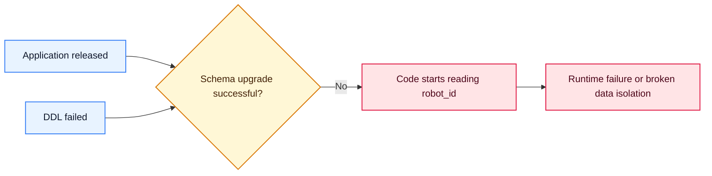
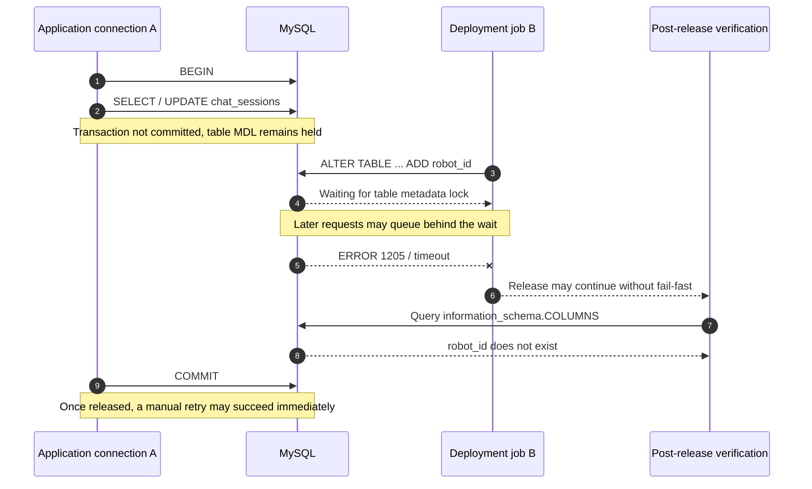
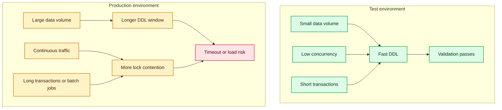
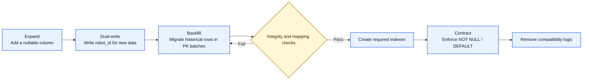
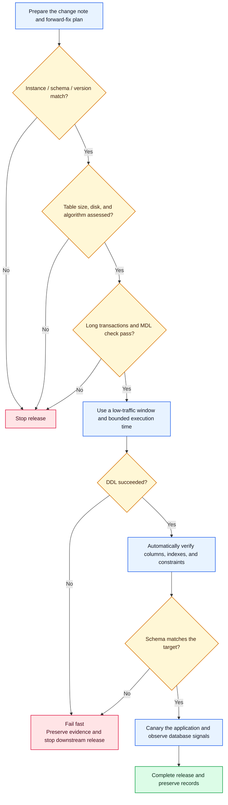

> An ordinary `ADD COLUMN` ran successfully in test, but left production in a dangerous intermediate state: the application had shipped while the `robot_id` column had not been created. The only explicit clue in the deployment log was `ERROR 1205 (HY000): Lock wait timeout exceeded`.

## TL;DR

| Dimension | Conclusion |
| --- | --- |
| Symptom | `chat_sessions`, `chat_runs`, and `chat_messages` did not receive the expected `robot_id` column after the production deployment |
| Direct cause | `ALTER TABLE` timed out while waiting for a lock; the release process either did not stop the application deployment or did not surface the failure clearly enough |
| Leading root-cause hypothesis | An active transaction held a Metadata Lock (MDL) on the target table, preventing the DDL from obtaining the exclusive metadata lock it required |
| Ruled out | Basic SQL syntax was not the primary cause; equivalent `ADD COLUMN` syntax is supported by common MySQL 5.7 and 8.0 versions |
| Version differences | They can change the DDL algorithm, whether a table rebuild is required, execution time, and the contention window. They are amplifiers, not a direct syntax-level cause |
| Evidence boundary | Because the blocking sessions were not fully captured during the incident, no specific transaction can be identified as the blocker after the fact |
| Main improvements | Check long transactions and MDL before release; evaluate the DDL algorithm explicitly; fail fast; verify the schema automatically; use phased migrations or online schema-change tools for large tables |

In one sentence:

> **The same SQL succeeding later proves only that it can run—not that it is safe to run under production traffic.**

## 1. Incident background

To support data isolation by robot, three business tables needed a new `robot_id` column and related indexes. The core change looked like this:

```sql
ALTER TABLE chat_sessions
ADD COLUMN robot_id VARCHAR(64)
NOT NULL DEFAULT 'data-agent'
COMMENT 'Robot ID used for data isolation'
AFTER id;
```

The same script succeeded in test and during manual verification. After the production release, however, the column was missing. The deployment log contained the key error:

```text
ERROR 1205 (HY000) at line 4 in file update.sql:
Lock wait timeout exceeded; try restarting transaction
```

The danger was not merely that one SQL statement failed. The system entered a state where the application version and database schema no longer matched:



## 2. Impact and risk

The confirmed impact was that the database columns were not created as planned. Even if the application did not fail immediately, several risks remained:

- New code could raise `Unknown column` when reading or writing `robot_id`.
- An apparently successful application deployment could hide a failed database migration.
- Multiple tables could be left at different migration stages, making retries vulnerable to duplicate-column or duplicate-index errors.
- If `robot_id` defines tenant or robot isolation, an incorrect default or backfill could become a data-boundary incident.
- A manual rerun might restore the schema while leaving the underlying lock contention and release-process defects unresolved.

## 3. Separate facts, inferences, and open questions

The easiest mistake in a production postmortem is to present a plausible explanation as a proven root cause. The evidence in this incident should be layered carefully:

| Type | Evidence | Confidence |
| --- | --- | --- |
| Confirmed facts | Production lacked `robot_id`; logs contained `ERROR 1205`; the same SQL succeeded later | High |
| Strong inference | The DDL encountered lock contention; for `ALTER TABLE`, MDL is the first place to investigate | Medium to high |
| Possible amplifiers | Long transactions, high concurrency, large tables, MySQL version differences, a rebuild caused by `AFTER`, or deployment timeout | Medium |
| Not proven | Which connection, query, or job held the blocking lock | Low without live evidence |
| Unsupported conclusion | “MySQL 5.7 does not support this `ADD COLUMN` syntax” | Ruled out |

A rigorous root-cause statement is therefore:

> **The direct cause is confirmed: the production `ALTER TABLE` failed after a lock wait timeout. Given DDL locking semantics, Metadata Lock contention is the most likely blocking mechanism. Because session and lock relationships were not captured during the wait, the exact blocker cannot be identified uniquely after the event.**

## 4. Investigation method: from static correctness to runtime state

Database-change failures fall into two broad groups:

| Static issues | Dynamic issues |
| --- | --- |
| SQL syntax error | Metadata Lock contention |
| Column or index already exists | Long-running or idle uncommitted transaction |
| Referenced column does not exist | High concurrency and queueing effects |
| Account lacks `ALTER` permission | Table rebuild, I/O, or temporary-space pressure |
| Wrong instance, schema, or read-only replica | Deployment platform or proxy timeout |
| Migration version was skipped | DDL algorithm does not fit the production workload |

`ERROR 1205` shifts the center of gravity from “Is the SQL written correctly?” to “What was the database doing at that exact moment?” Before diving into locks, still rule out the wrong database, missing permissions, read-only state, and migration-history errors.

### 4.1 Confirm the target and version

Run the following from both the deployment connection and the manual verification connection:

```sql
SELECT
    DATABASE() AS db_name,
    @@hostname AS hostname,
    @@port AS port,
    @@server_uuid AS server_uuid,
    VERSION() AS mysql_version,
    @@version_comment AS version_comment;
```

Compare `DATABASE()`, host, port, and `server_uuid`. Identically named schemas, read/write splitting, proxies, and multiple clusters can all produce the illusion that the log shows a successful execution while the expected column cannot be found.

### 4.2 Confirm identity, privileges, and read-only state

```sql
SELECT USER() AS login_identity, CURRENT_USER() AS privilege_identity;

SHOW GRANTS FOR CURRENT_USER();

SELECT
    @@read_only AS read_only,
    @@super_read_only AS super_read_only;
```

Do not rely only on a green deployment status. Inspect the database client's original error and final exit code.

### 4.3 Confirm the actual schema and migration history

```sql
SHOW CREATE TABLE chat_sessions;
SHOW CREATE TABLE chat_runs;
SHOW CREATE TABLE chat_messages;

SELECT
    TABLE_NAME,
    COLUMN_NAME,
    COLUMN_TYPE,
    IS_NULLABLE,
    COLUMN_DEFAULT
FROM information_schema.COLUMNS
WHERE TABLE_SCHEMA = DATABASE()
  AND TABLE_NAME IN ('chat_sessions', 'chat_runs', 'chat_messages')
  AND COLUMN_NAME = 'robot_id';
```

If the system uses Flyway, Liquibase, or an in-house migration framework, inspect its version table as well. A classic anti-pattern is editing an old migration that has already run in production: new environments execute the modified content, while production skips it according to migration history.

## 5. How Metadata Lock makes ALTER TABLE fail

MySQL uses Metadata Locks to keep object definitions consistent with concurrent access. After a transaction accesses a table, its metadata lock may remain until commit or rollback. `ALTER TABLE` must obtain the exclusive metadata lock appropriate for the structural change.



This explains why “the automated deployment failed but a later manual run succeeded” is not contradictory:

- The SQL did not change.
- The schema did not change.
- The transaction and lock state at execution time did.

There is also a queueing effect. A DDL request waiting for exclusive MDL can cause later requests against the same table to queue as well, expanding one blocked DDL into a pile-up of application connections. A stuck DDL should not be allowed to wait indefinitely.

## 6. Finding who blocks whom during the incident

Lock incidents are highly time-sensitive. The most valuable action is not simply “cancel and retry later,” but to preserve evidence first when it is safe to do so.

### 6.1 Inspect active sessions

```sql
SHOW FULL PROCESSLIST;
```

Look specifically for:

```text
Waiting for table metadata lock
```

Record the connection ID, user, source address, database, wait duration, and SQL text.

### 6.2 Inspect long-running transactions

```sql
SELECT
    trx_id,
    trx_mysql_thread_id,
    trx_started,
    trx_state,
    trx_rows_locked,
    trx_rows_modified,
    trx_query
FROM information_schema.innodb_trx
ORDER BY trx_started;
```

`trx_query IS NULL` does not mean a transaction is harmless. A connection may be in `Sleep` while its transaction remains uncommitted—one of the least visible ways an idle transaction can keep locks alive.

### 6.3 Inspect table-lock wait relationships

When the `sys` schema is available:

```sql
SELECT
    object_schema,
    object_name,
    waiting_pid,
    waiting_query,
    waiting_query_secs,
    blocking_pid,
    blocking_account,
    sql_kill_blocking_connection
FROM sys.schema_table_lock_waits
WHERE object_schema = DATABASE()
  AND object_name IN ('chat_sessions', 'chat_runs', 'chat_messages');
```

`sql_kill_blocking_connection` is only diagnostic assistance. Never execute it automatically. Before terminating a production connection, confirm the transaction's work, rollback cost, business impact, and on-call authorization.

### 6.4 Inspect MDL in Performance Schema

```sql
SELECT
    ml.OBJECT_TYPE,
    ml.OBJECT_SCHEMA,
    ml.OBJECT_NAME,
    ml.LOCK_TYPE,
    ml.LOCK_DURATION,
    ml.LOCK_STATUS,
    t.PROCESSLIST_ID,
    t.PROCESSLIST_USER,
    t.PROCESSLIST_HOST,
    t.PROCESSLIST_TIME,
    t.PROCESSLIST_STATE,
    t.PROCESSLIST_INFO
FROM performance_schema.metadata_locks AS ml
LEFT JOIN performance_schema.threads AS t
       ON t.THREAD_ID = ml.OWNER_THREAD_ID
WHERE ml.OBJECT_SCHEMA = DATABASE()
  AND ml.OBJECT_NAME IN ('chat_sessions', 'chat_runs', 'chat_messages')
ORDER BY ml.OBJECT_NAME, ml.LOCK_STATUS, t.PROCESSLIST_TIME DESC;
```

Inspect both `GRANTED` and `PENDING` rows. The former are locks already held; the latter are requests still waiting.

### 6.5 Do not confuse the two timeout variables

```sql
SHOW VARIABLES
WHERE Variable_name IN ('lock_wait_timeout', 'innodb_lock_wait_timeout');
```

| Variable | Primary scope |
| --- | --- |
| `lock_wait_timeout` | Metadata Lock waits |
| `innodb_lock_wait_timeout` | InnoDB row-lock waits |

Both classes of timeout can surface as `ERROR 1205`, so the error code alone does not prove the lock type. Use the SQL statement, Processlist, `metadata_locks`, and transaction state together. Because the failed statement here was `ALTER TABLE`, MDL is the leading direction.

## 7. Why test did not catch it

| Dimension | Test | Production | Risk |
| --- | --- | --- | --- |
| Data volume | Small | Potentially orders of magnitude larger | Table rebuilds and index creation take very different amounts of time |
| Concurrent connections | Few and short-lived | Numerous and continuous | DDL is more likely to compete for MDL |
| Transaction profile | Few long transactions | Batch jobs, reports, consumers, and manual operations coexist | Lock duration becomes less predictable |
| MySQL version | Potentially newer | Potentially older | DDL algorithms and capabilities differ |
| Table definition | Often created from a fresh script | Evolved over years | Row format, indexes, and dependencies may differ |
| Release window | Tests can run at any time | Executes under real traffic | The contention window expands |
| Verification target | “Can the SQL run?” | “Can it run safely within production constraints?” | Functional correctness is not operational correctness |



## 8. MySQL version differences: not syntax, but still a risk multiplier

The basic `ADD COLUMN ... DEFAULT ... COMMENT ... AFTER ...` syntax works in common MySQL 5.7 and 8.0 versions. What actually needs comparison is the execution algorithm and cost.

| Capability | MySQL 5.7 | MySQL 8.0 |
| --- | --- | --- |
| Common algorithm for `ADD COLUMN` | Supports `INPLACE`, but normally rebuilds the table | From 8.0.12, eligible changes may use `INSTANT` |
| Instant add column at an arbitrary position | Not supported | Supported from 8.0.29 when restrictions are met |
| Effect of `AFTER id` | Requires data reorganization | Before 8.0.29, cannot use Instant at an arbitrary position and may fall back to a heavier algorithm |
| DDL atomicity | DDL generally performs implicit commits with limited recovery semantics | The 8.0 data dictionary supports atomic DDL more broadly |

This means `AFTER id`, although mainly a presentation preference, can change the execution path. Physical column position rarely improves query performance. Unless compatibility requires it, remove `AFTER` so the database has a better chance of using a low-cost algorithm.

Do not guess the algorithm. Rehearse against the same minor version, table definition, row format, and index conditions as production. Use explicit constraints to prevent silent degradation:

```sql
-- Use only after confirming support in the current version and table.
-- Fail immediately when INSTANT cannot be honored.
ALTER TABLE chat_sessions
    ADD COLUMN robot_id VARCHAR(64) NULL,
    ALGORITHM=INSTANT;
```

For an in-place plan:

```sql
ALTER TABLE chat_sessions
    ADD COLUMN robot_id VARCHAR(64) NULL,
    ALGORITHM=INPLACE,
    LOCK=NONE;
```

Explicit constraints make MySQL fail with a reason when it cannot satisfy the intended algorithm or concurrency level instead of silently selecting a more expensive path in production.

## 9. A safer robot_id migration

Adding the column directly as:

```sql
NOT NULL DEFAULT 'data-agent'
```

would reinterpret every historical row whose origin is unknown as belonging to a single robot. If `robot_id` enforces data isolation, this is a data-semantics problem before it is a DDL problem.

A safer approach is Expand → Migrate → Contract:



Key principles:

1. Add a backward-compatible structure first so the old application keeps working.
2. Have the new application dual-write or reliably populate `robot_id`.
3. Backfill historical data in small, pausable, retryable primary-key ranges.
4. Validate nulls, invalid values, relationships, and per-robot distributions.
5. Use `EXPLAIN` against real queries to validate indexes.
6. Tighten `NOT NULL`, defaults, and old compatibility logic only at the end.

## 10. Re-evaluate index design during the migration

The original proposal included several indexes starting with `robot_id`. Use the leftmost-prefix rule to eliminate unnecessary write amplification:

| Table | Candidate indexes | Evaluation |
| --- | --- | --- |
| `chat_sessions` | `(robot_id)` and `(robot_id, deleted_at)` | The composite index can usually support equality lookups on `robot_id` alone, so the single-column index may be redundant |
| `chat_runs` | `(robot_id)` and `(robot_id, status)` | The composite index covers the `robot_id` prefix; decide using ordering needs, covering queries, and cardinality |
| `chat_messages` | `(robot_id)`, `(session_id, robot_id)`, and `(run_id, robot_id)` | The latter two do not efficiently replace queries whose first predicate is `robot_id`, so the single-column index may still be useful |

“Possibly redundant” does not mean “safe to delete immediately.” Base the final decision on real SQL, `EXPLAIN` plans, cardinality, write overhead, and slow-query evidence.

## 11. A standardized production DDL release



### 11.1 Before release

- Confirm the target instance, port, `server_uuid`, schema, and primary/replica role.
- Compare the exact MySQL version, storage engine, row format, and table definition between production and rehearsal.
- Estimate row count, data size, index size, and available disk.
- Confirm the DDL algorithm, whether it rebuilds the table, concurrent-DML behavior, and expected duration.
- Check long-running transactions, idle uncommitted transactions, MDL waits, backups, reports, and batch jobs.
- Define the maximum wait, stop conditions, observability signals, and decision owner.
- For isolation fields, define how historical data will be mapped; do not substitute a default value for a business decision.
- Prepare a forward-fix plan. Dropping a column or reversing a large-table DDL should not be treated as cheap.

Estimate table size with:

```sql
SELECT
    TABLE_NAME,
    TABLE_ROWS,
    ROUND(DATA_LENGTH / 1024 / 1024 / 1024, 2) AS data_gb,
    ROUND(INDEX_LENGTH / 1024 / 1024 / 1024, 2) AS index_gb
FROM information_schema.TABLES
WHERE TABLE_SCHEMA = DATABASE()
  AND TABLE_NAME IN ('chat_sessions', 'chat_runs', 'chat_messages');
```

`TABLE_ROWS` is normally an estimate for InnoDB, but it is enough to establish the order of magnitude.

### 11.2 During release

- Make application changes explicitly depend on database changes; never ship code that requires the new column before the DDL completes.
- Use a finite and observable wait budget instead of allowing a DDL to queue forever.
- Monitor threads, QPS, latency, lock waits, disk I/O, replication lag, and connection pools.
- When `Waiting for table metadata lock` appears, enter the incident procedure instead of retrying blindly.
- Avoid client options that swallow SQL errors; a non-zero migration exit must fail the pipeline.
- For large tables, use a reviewed online schema-change tool when necessary, and rehearse throttling, pause, and cleanup behavior.

### 11.3 After release

Do not treat “the command finished” as “the change succeeded.” At minimum, verify automatically:

```sql
-- All three tables must return one row each.
SELECT
    TABLE_NAME,
    COLUMN_TYPE,
    IS_NULLABLE,
    COLUMN_DEFAULT
FROM information_schema.COLUMNS
WHERE TABLE_SCHEMA = DATABASE()
  AND TABLE_NAME IN ('chat_sessions', 'chat_runs', 'chat_messages')
  AND COLUMN_NAME = 'robot_id'
ORDER BY TABLE_NAME;
```

Also validate index-column order, application reads and writes, error rate, slow queries, replication lag, and the correctness of historical mappings. A failed verification must prevent the release from being marked successful.

## 12. Reusable checklist

### Change design

- [ ] Create a new migration for every change; never edit a migration already released.
- [ ] Define column defaults and the semantics of historical backfill.
- [ ] Use Expand → Migrate → Contract for incompatible changes.
- [ ] Remove unnecessary `AFTER` / `FIRST` clauses instead of paying DDL cost for presentation.
- [ ] Validate indexes against real queries and avoid redundant indexes.

### Production assessment

- [ ] Confirm instance, schema, primary/replica role, account, and permissions.
- [ ] Confirm the exact MySQL version, engine, row format, and `SHOW CREATE TABLE`.
- [ ] Assess row count, table size, disk, replication lag, and the DDL algorithm.
- [ ] Rehearse on an equivalent version and representative data volume.
- [ ] Decide whether an online schema-change tool is required.

### Execution window

- [ ] Check long transactions, Sleep in transaction, and MDL waits.
- [ ] Avoid batch jobs, backups, reports, and peak traffic.
- [ ] Set a finite wait time, stop conditions, and an accountable owner.
- [ ] Monitor critical database and application signals.
- [ ] Ensure an SQL failure immediately fails the release.

### Result verification

- [ ] Query `information_schema.COLUMNS` to verify column definitions.
- [ ] Query `information_schema.STATISTICS` to verify indexes and column order.
- [ ] Complete compatibility checks and a minimal application smoke test.
- [ ] Validate the completeness and isolation semantics of historical backfill.
- [ ] Preserve SQL output, schema snapshots, execution duration, and monitoring evidence.

## 13. What this incident actually exposed

On the surface, this was an `ALTER TABLE` timeout. Systemically, it exposed three gaps:

1. **An incomplete validation model:** test proved syntax and functional correctness, not executability under production scale and concurrency.
2. **An incomplete release gate:** the process could continue after a database change failed, so the application and schema lacked a hard dependency.
3. **Incomplete observability:** transaction, Processlist, and MDL relationships were not captured automatically during the wait, leaving only a strong hypothesis rather than a closed evidence chain.

The best fix is therefore not to increase the timeout. A longer timeout can leave both the DDL and later application requests queued for longer, magnifying the impact. The right direction is to shorten transactions, select an appropriate window and algorithm, bound the wait, stop on failure, and make schema verification a release-completion condition.

## 14. Lessons learned

- Correct SQL is not necessarily executable SQL in production; functional and operational correctness are separate acceptance criteria.
- `ERROR 1205` is the beginning of the investigation, not a complete root cause; close the loop with live lock and transaction evidence.
- For DDL, even an ordinary query can become a blocker when its transaction remains open.
- A successful manual retry usually means runtime state changed; it does not disprove lock contention.
- Analyze version differences in terms of algorithm and cost, not merely syntax compatibility.
- Physical column order is rarely worth giving up the opportunity for Instant DDL.
- Defaults for data-isolation fields require business-semantic review.
- A release is successful only when the migration, schema verification, and application verification all succeed.

## References

- [MySQL 8.0 Reference Manual: Online DDL Operations](https://dev.mysql.com/doc/refman/8.0/en/innodb-online-ddl-operations.html)
- [MySQL 5.7 Reference Manual: Online DDL Operations](https://dev.mysql.com/doc/refman/5.7/en/innodb-online-ddl-operations.html)
- [MySQL 8.0 Reference Manual: Metadata Locking](https://dev.mysql.com/doc/refman/8.0/en/metadata-locking.html)
- [MySQL Performance Schema: `metadata_locks` Table](https://dev.mysql.com/doc/mysql-perfschema-excerpt/8.0/en/performance-schema-metadata-locks-table.html)
- [MySQL 8.0 Reference Manual: `schema_table_lock_waits` View](https://dev.mysql.com/doc/refman/8.0/en/sys-schema-table-lock-waits.html)

> Rendering note: this site renders the Mermaid diagrams in this article directly in the browser.
