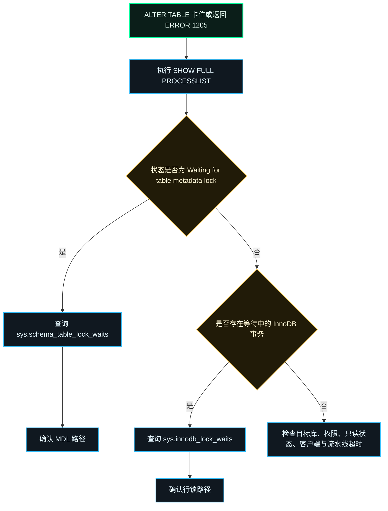
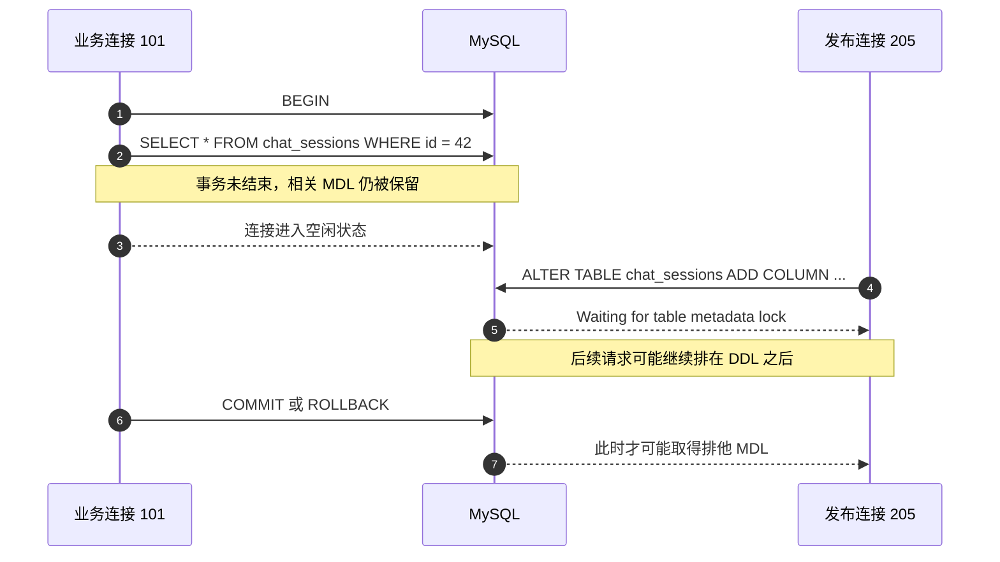
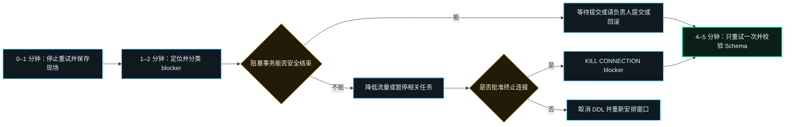

> 生产中的 `ALTER TABLE` 长时间卡住，最后返回 `ERROR 1205 (HY000): Lock wait timeout exceeded`。这一定是 Metadata Lock 吗？到底会等多久、是谁阻塞了 DDL，又该怎样尽快完成变更而不把一次失败扩大成事故？

本文是[上一篇生产故障复盘](/blog/zh/posts/mysql-alter-table-lock-wait-timeout-postmortem/)的实战配套手册，把结论整理成一套五分钟内可以执行的排查与处置流程。

## TL;DR

| 问题 | 可执行结论 |
| --- | --- |
| 如何确认问题正在发生？ | 先执行 `SHOW FULL PROCESSLIST`。如果 DDL 状态为 `Waiting for table metadata lock`，再用 `sys.schema_table_lock_waits` 或 `performance_schema.metadata_locks` 确认等待与阻塞关系。 |
| 锁多久会报错？ | InnoDB 行锁通常由 `innodb_lock_wait_timeout` 控制，默认 50 秒；MDL 由 `lock_wait_timeout` 控制，默认 31,536,000 秒。Session 覆盖值和发布平台的截止时间常让实际等待更短。 |
| 怎样找到是谁在锁表？ | `sys.schema_table_lock_waits` 可直接给出 `waiting_pid` 和 `blocking_pid`；再结合 `information_schema.innodb_trx` 与 Processlist 判断阻塞连接的事务状态。 |
| 怎样尽快完成更新？ | 停止盲目重试并保存现场；正常短事务可等待结束，其他事务由负责人提交或回滚。只有完成影响评估后才使用 `KILL CONNECTION`，锁释放后只重试一次并校验 Schema。 |

首先要保留一个重要边界：

> **`ERROR 1205` 只能证明发生了锁等待超时，不能单凭错误码断定一定是 MDL。**

## 1. 先判断是哪一类锁等待

InnoDB 行锁等待和 MySQL Server 层的 Metadata Lock 等待都可能返回 `ERROR 1205`。因此，错误码是排查起点，不是根因结论。



从另一个数据库连接执行：

```sql
SHOW FULL PROCESSLIST;
```

`ALTER TABLE` 被 MDL 阻塞时，最关键的现场特征是：

```text
Id: 205
Command: Query
Time: 37
State: Waiting for table metadata lock
Info: ALTER TABLE chat_sessions ADD COLUMN robot_id ...
```

如果没有这个状态，就不要强行套用 MDL 解释。排查 InnoDB 数据锁时可查询：

```sql
SELECT *
FROM sys.innodb_lock_waits\G
```

同时还要排除：连错实例或 Schema、目标库只读、缺少 `ALTER` 权限，以及数据库客户端、代理、CI 任务或发布平台主动终止请求。

## 2. 确认“谁在等谁”

对于带有 `sys` Schema 的 MySQL，最快的 MDL 定位语句是：

```sql
SELECT
    object_schema,
    object_name,
    waiting_pid,
    waiting_account,
    waiting_query,
    waiting_query_secs,
    blocking_pid,
    blocking_account,
    blocking_lock_type,
    sql_kill_blocking_query,
    sql_kill_blocking_connection
FROM sys.schema_table_lock_waits
WHERE object_schema = DATABASE()
  AND object_name IN (
      'chat_sessions',
      'chat_runs',
      'chat_messages'
  )\G
```

应把结果理解成依赖关系，而不是一张“繁忙会话列表”：

```text
blocking_pid 101
       │ 持有已经授予的 Metadata Lock
       ▼
waiting_pid 205
ALTER TABLE ... 正在等待排他 MDL
```

需要更底层的证据时，查询 `performance_schema.metadata_locks`。等待中的请求表现为 `LOCK_STATUS = 'PENDING'`，已经持有的锁通常为 `LOCK_STATUS = 'GRANTED'`。

```sql
SELECT
    ml.OBJECT_SCHEMA,
    ml.OBJECT_NAME,
    ml.LOCK_TYPE,
    ml.LOCK_DURATION,
    ml.LOCK_STATUS,
    t.PROCESSLIST_ID,
    t.PROCESSLIST_USER,
    t.PROCESSLIST_HOST,
    t.PROCESSLIST_TIME,
    t.PROCESSLIST_STATE,
    t.PROCESSLIST_INFO
FROM performance_schema.metadata_locks AS ml
JOIN performance_schema.threads AS t
  ON t.THREAD_ID = ml.OWNER_THREAD_ID
WHERE ml.OBJECT_SCHEMA = DATABASE()
  AND ml.OBJECT_NAME = 'chat_sessions'
ORDER BY ml.LOCK_STATUS, t.PROCESSLIST_TIME DESC;
```

这些证据必须在故障仍然存在时保存。锁释放后，对应记录会从 `metadata_locks` 删除；后续手工执行成功，也无法反推出当时的 blocker。

## 3. 为什么普通 SELECT 也可能阻塞 DDL

MySQL 使用 Metadata Lock 保证对象定义与并发访问的一致性。事务访问一张表后，相关 MDL 可能一直保留到 `COMMIT` 或 `ROLLBACK`。即使连接已经显示为 `Sleep`，它的事务仍可能处于打开状态。



特别是 `blocking_query` 为 `NULL` 时，要从事务角度检查阻塞连接：

```sql
SELECT
    trx_id,
    trx_state,
    trx_started,
    trx_mysql_thread_id,
    trx_rows_locked,
    trx_rows_modified,
    trx_query
FROM information_schema.innodb_trx
WHERE trx_mysql_thread_id IN (101, 205);
```

如果连接空闲，但 `trx_started` 已经很早，这是一个强信号：最初访问表的 SQL 已执行完，事务边界却一直没有结束。

## 4. 锁多久会报这个错误？

不要只背默认值，应直接查询当前服务器和当前 Session：

```sql
SELECT
    @@GLOBAL.lock_wait_timeout AS global_mdl_timeout_s,
    @@SESSION.lock_wait_timeout AS session_mdl_timeout_s,
    @@GLOBAL.innodb_lock_wait_timeout AS global_row_timeout_s,
    @@SESSION.innodb_lock_wait_timeout AS session_row_timeout_s;
```

| 控制层 | 作用对象 | MySQL 8.0 默认值 | 关键说明 |
| --- | --- | ---: | --- |
| `innodb_lock_wait_timeout` | InnoDB 行锁等待 | 50 秒 | 不控制 MDL。超时后通常只回滚当前语句，不会自动回滚整个事务。 |
| `lock_wait_timeout` | Metadata Lock 获取 | 31,536,000 秒 | 该值对每一次元数据锁获取分别生效；一条语句申请多个锁时，总等待时间可能更长。 |
| 客户端、代理、CI、发布任务 | 连接、SQL 或任务生命周期 | 由环境决定 | 外层截止时间可能早于 MySQL 的两个默认值。 |

因此，DDL 在 30 秒或 60 秒后失败，并不与 MDL 默认约一年矛盾：当前 Session 可能修改过 `lock_wait_timeout`，也可能是外层系统终止了请求。必须保留数据库原始错误、客户端退出码和发布日志，才能区分这些情况。

通常不应把“增大超时”作为第一解决方案。等待排他锁的 DDL 可能参与形成请求队列；允许它等得更久，反而可能扩大影响范围。

## 5. 五分钟快速处置手册



### 第 0–1 分钟：停止放大影响，保存证据

- 停止自动重试同一条 DDL；
- 保存 `SHOW FULL PROCESSLIST` 和 `sys.schema_table_lock_waits` 输出；
- 记录等待方与阻塞方的进程 ID、账号、来源主机、事务年龄和 SQL；
- 观察应用延迟、活跃连接数和连接池排队情况。

### 第 1–2 分钟：对 blocker 分类

| 阻塞来源 | 优先处理方式 |
| --- | --- |
| 正常的短事务 | 短暂等待其正常提交。 |
| 已知批处理、报表或管理会话 | 联系负责人提交、回滚或停止任务。 |
| 业务连接中的空闲未提交事务 | 修复所属服务，或由负责人回滚事务。 |
| 目标表上的高业务流量 | 先降低或临时停止相关流量，再执行 DDL。 |
| 未知或高风险事务 | 取消 DDL 并升级处理，不凭猜测执行 `KILL`。 |

### 第 2–4 分钟：安全释放锁

优先由事务负责人正常 `COMMIT` 或 `ROLLBACK`。如果确认连接已经失控，并完成了终止影响评估，可使用准确的 `blocking_pid`：

```sql
KILL CONNECTION 101;
```

`KILL QUERY` 只终止当前正在执行的语句，连接本身仍然存在。因此对于“连接在 Sleep，但打开的事务仍持锁”的场景，它并不足够。`KILL CONNECTION` 会结束连接，但大事务的回滚与清理仍可能耗时，不能期待执行后锁瞬间消失。

不要直接复制 `sql_kill_blocking_connection` 到生产执行。必须先确认账号、来源主机、事务内容、影响行数和业务负责人。

### 第 4–5 分钟：只重试一次，然后证明成功

确认 blocker 已消失且业务流量稳定后，只重跑一次 migration。随后独立校验结果：

```sql
SELECT
    TABLE_NAME,
    COLUMN_NAME,
    COLUMN_TYPE,
    IS_NULLABLE,
    COLUMN_DEFAULT
FROM information_schema.COLUMNS
WHERE TABLE_SCHEMA = DATABASE()
  AND TABLE_NAME IN ('chat_sessions', 'chat_runs', 'chat_messages')
  AND COLUMN_NAME = 'robot_id'
ORDER BY TABLE_NAME;
```

Migration 命令成功、Schema 校验成功、最小业务读写成功，三者全部满足，发布才算完成。

## 6. 让下一次 ALTER 更容易成功

对于 MySQL 8.0 中满足条件的 `ADD COLUMN`，建议显式要求 Instant DDL。这样条件不支持时会直接失败，而不是悄悄选择代价更高的算法：

```sql
ALTER TABLE chat_sessions
    ADD COLUMN robot_id VARCHAR(64) NULL,
    ALGORITHM=INSTANT;
```

- MySQL 8.0.12 引入 Instant `ADD COLUMN`；在 8.0.29 之前，新列只能追加到表尾；
- MySQL 8.0.29 及以后可在任意位置使用 Instant `ADD COLUMN`，但仍受官方文档中的条件限制；
- MySQL 5.7 没有 `ALGORITHM=INSTANT`。支持时使用 `ALGORITHM=INPLACE, LOCK=NONE` 可以允许并发 DML，但仍可能产生大量工作；
- Instant 或 Online DDL **不会消除 MDL**。它们减少的是工作量和竞争窗口，DDL 仍然需要完成元数据锁转换。

字段物理顺序通常不值得保留一个 `AFTER` 子句。除非存在真实兼容要求，否则应删除它。对于关键的数据隔离字段，还应考虑分阶段迁移：先添加可空字段，发布兼容新旧结构的代码，分批回填与校验，最后再收紧约束。

## 7. 发布防线

### 发布前

- [ ] 核对实例、Schema、主库角色、账号、权限和精确 MySQL 版本；
- [ ] 检查长事务、空闲事务、已有 MDL 等待、备份、报表和批处理任务；
- [ ] 确认 DDL 算法及是否重建表；
- [ ] 设定有限等待时间、停止条件，以及有权终止 blocker 的负责人。

### 发布中

- [ ] 数据库变更失败必须阻止应用继续发布；
- [ ] 完整保存数据库客户端输出、原始错误和退出码；
- [ ] 监控延迟、活跃连接、锁等待、I/O 和复制延迟；
- [ ] 已有一条 DDL 在等待时，不再启动重复 DDL。

### 发布后

- [ ] 通过 `information_schema` 校验字段与索引；
- [ ] 完成最小业务读写验证；
- [ ] 保存 Processlist、锁、事务、发布日志和 Schema 证据；
- [ ] 如果发布流程要求人工复核，由运维确认发布日志并附上截图证据。

## 8. 最终结论

快速解决不等于立即杀掉“看起来最老”的连接，而是快速降低不确定性：

1. 确认正在等待的是 MDL 还是 InnoDB 行锁；
2. 建立明确的 waiting-to-blocking 依赖关系；
3. 弄清 MySQL 与发布链路共同决定的实际超时时间；
4. 通过风险最低的事务边界释放 blocker；
5. 只重试一次，并独立校验最终 Schema。

长期有效的修复不是把超时调大，而是缩短事务、限制 DDL 等待、选择合适的在线算法、发布失败即停止，以及自动校验 Schema。

## 参考资料

- [MySQL 8.0 Reference Manual: Metadata Locking](https://dev.mysql.com/doc/refman/8.0/en/metadata-locking.html)
- [MySQL 8.0 Reference Manual: `metadata_locks` Table](https://dev.mysql.com/doc/refman/8.0/en/performance-schema-metadata-locks-table.html)
- [MySQL 8.0 Reference Manual: `schema_table_lock_waits` View](https://dev.mysql.com/doc/refman/8.0/en/sys-schema-table-lock-waits.html)
- [MySQL 8.0 Reference Manual: `innodb_lock_waits` View](https://dev.mysql.com/doc/refman/8.0/en/sys-innodb-lock-waits.html)
- [MySQL 8.0 Reference Manual: Server System Variables](https://dev.mysql.com/doc/refman/8.0/en/server-system-variables.html#sysvar_lock_wait_timeout)
- [MySQL 8.0 Reference Manual: InnoDB System Variables](https://dev.mysql.com/doc/refman/8.0/en/innodb-parameters.html#sysvar_innodb_lock_wait_timeout)
- [MySQL 8.0 Reference Manual: Online DDL Operations](https://dev.mysql.com/doc/refman/8.0/en/innodb-online-ddl-operations.html)
- [MySQL 8.0 Reference Manual: `KILL` Statement](https://dev.mysql.com/doc/refman/8.0/en/kill.html)

> 渲染说明：本站会在浏览器中直接渲染本文的 Mermaid 图表。
