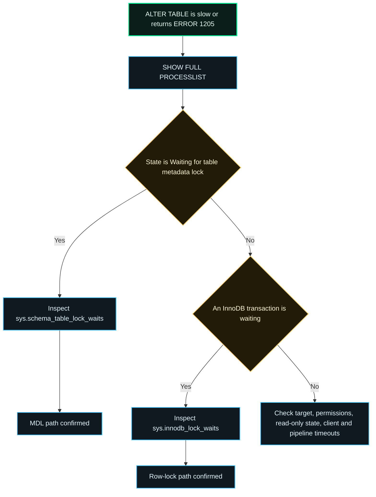
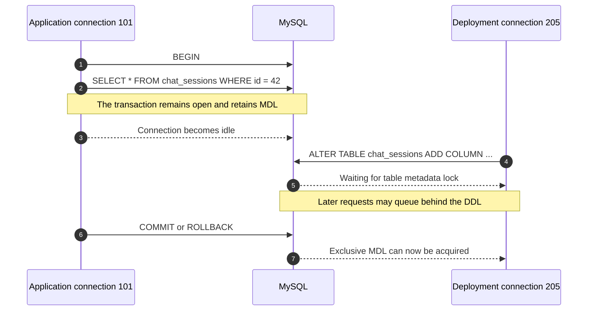
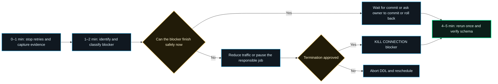

> An `ALTER TABLE` is stuck in production and eventually returns `ERROR 1205 (HY000): Lock wait timeout exceeded`. Is it really a Metadata Lock? How long will it wait, which session is blocking it, and how can the change be completed without turning one failed DDL into a larger outage?

This article is the operational companion to [the full production postmortem](/blog/posts/mysql-alter-table-lock-wait-timeout-postmortem/). It turns the investigation into a reusable, five-minute incident runbook.

## TL;DR

| Question | Practical answer |
| --- | --- |
| How do I confirm the problem? | Run `SHOW FULL PROCESSLIST`. If the DDL state is `Waiting for table metadata lock`, confirm the relationship with `sys.schema_table_lock_waits` or `performance_schema.metadata_locks`. |
| How long before it fails? | InnoDB row locks use `innodb_lock_wait_timeout`, normally 50 seconds by default. Metadata Locks use `lock_wait_timeout`, normally 31,536,000 seconds. Session overrides and deployment deadlines often make the observed wait shorter. |
| Who is blocking the table? | `sys.schema_table_lock_waits` directly exposes `waiting_pid` and `blocking_pid`. Correlate the blocker with `information_schema.innodb_trx` and the Processlist. |
| How do I finish the change quickly? | Stop blind retries, capture evidence, let a healthy short transaction finish, or have the owner commit/roll back. Use `KILL CONNECTION` only after impact review, then rerun the DDL and verify the schema. |

The key qualification is:

> **`ERROR 1205` is evidence of a lock wait timeout, not proof that the wait was specifically an MDL wait.**

## 1. First classify the wait

Both an InnoDB row-lock wait and a server-layer Metadata Lock wait can surface as `ERROR 1205`. Treat the error code as the start of the diagnosis.



Start from another connection:

```sql
SHOW FULL PROCESSLIST;
```

The most useful signature for an `ALTER TABLE` blocked on MDL is:

```text
Id: 205
Command: Query
Time: 37
State: Waiting for table metadata lock
Info: ALTER TABLE chat_sessions ADD COLUMN robot_id ...
```

If that state is absent, do not force the incident into an MDL explanation. For InnoDB data-lock waits, inspect:

```sql
SELECT *
FROM sys.innodb_lock_waits\G
```

Also rule out a wrong instance or schema, a read-only target, missing `ALTER` privilege, and a timeout enforced by the database client, proxy, CI job, or deployment platform.

## 2. Confirm who waits for whom

On MySQL installations with the `sys` schema, the fastest MDL query is:

```sql
SELECT
    object_schema,
    object_name,
    waiting_pid,
    waiting_account,
    waiting_query,
    waiting_query_secs,
    blocking_pid,
    blocking_account,
    blocking_lock_type,
    sql_kill_blocking_query,
    sql_kill_blocking_connection
FROM sys.schema_table_lock_waits
WHERE object_schema = DATABASE()
  AND object_name IN (
      'chat_sessions',
      'chat_runs',
      'chat_messages'
  )\G
```

Interpret it as a dependency, not merely a list of busy sessions:

```text
blocking_pid 101
       │ holds a granted metadata lock
       ▼
waiting_pid 205
ALTER TABLE ... waiting for exclusive MDL
```

For lower-level evidence, inspect `performance_schema.metadata_locks`. A waiting request has `LOCK_STATUS = 'PENDING'`; a held lock normally has `LOCK_STATUS = 'GRANTED'`.

```sql
SELECT
    ml.OBJECT_SCHEMA,
    ml.OBJECT_NAME,
    ml.LOCK_TYPE,
    ml.LOCK_DURATION,
    ml.LOCK_STATUS,
    t.PROCESSLIST_ID,
    t.PROCESSLIST_USER,
    t.PROCESSLIST_HOST,
    t.PROCESSLIST_TIME,
    t.PROCESSLIST_STATE,
    t.PROCESSLIST_INFO
FROM performance_schema.metadata_locks AS ml
JOIN performance_schema.threads AS t
  ON t.THREAD_ID = ml.OWNER_THREAD_ID
WHERE ml.OBJECT_SCHEMA = DATABASE()
  AND ml.OBJECT_NAME = 'chat_sessions'
ORDER BY ml.LOCK_STATUS, t.PROCESSLIST_TIME DESC;
```

Capture this evidence while the incident is active. Once the lock is released, its row is deleted from `metadata_locks`; a later successful retry cannot reconstruct the original blocker.

## 3. Why an ordinary SELECT can block DDL

MySQL uses Metadata Locks to keep object definitions consistent while statements and transactions access them. A transaction that touches a table can retain its MDL until `COMMIT` or `ROLLBACK`. The connection may appear as `Sleep` even though its transaction is still open.



Inspect the blocking process as a transaction, especially when `blocking_query` is `NULL`:

```sql
SELECT
    trx_id,
    trx_state,
    trx_started,
    trx_mysql_thread_id,
    trx_rows_locked,
    trx_rows_modified,
    trx_query
FROM information_schema.innodb_trx
WHERE trx_mysql_thread_id IN (101, 205);
```

An idle connection with an old `trx_started` value is a strong clue. The statement that originally touched the table may have finished, but the transaction boundary has not.

## 4. How long will the lock wait?

Ask the server instead of relying on defaults:

```sql
SELECT
    @@GLOBAL.lock_wait_timeout AS global_mdl_timeout_s,
    @@SESSION.lock_wait_timeout AS session_mdl_timeout_s,
    @@GLOBAL.innodb_lock_wait_timeout AS global_row_timeout_s,
    @@SESSION.innodb_lock_wait_timeout AS session_row_timeout_s;
```

| Layer | Controls | MySQL 8.0 default | Important detail |
| --- | --- | ---: | --- |
| `innodb_lock_wait_timeout` | InnoDB row-lock waits | 50 seconds | It does not govern MDL. On timeout, the current statement is normally rolled back, not automatically the entire transaction. |
| `lock_wait_timeout` | Metadata Lock acquisition | 31,536,000 seconds | The value applies to each metadata-lock attempt. One statement can request multiple locks and therefore wait longer in total. |
| Client, proxy, CI, deployment job | Connection, query, or job lifetime | Environment-specific | This outer deadline may end the operation before either MySQL default is reached. |

So a DDL failing after 30 or 60 seconds does not contradict the one-year MDL default. The session may have overridden `lock_wait_timeout`, or an outer system may have terminated the request. Preserve the original database error, client exit code, and job log to tell those cases apart.

Increasing the timeout is usually not the first fix. A waiting exclusive DDL can contribute to request queueing; allowing it to wait longer can enlarge the blast radius.

## 5. The five-minute recovery runbook



### Minute 0–1: stop amplification and preserve evidence

- Stop automated retries of the same DDL.
- Save `SHOW FULL PROCESSLIST` and `sys.schema_table_lock_waits` output.
- Record the waiting and blocking process IDs, accounts, hosts, transaction age, and SQL.
- Watch application latency, active connections, and the connection-pool queue.

### Minute 1–2: classify the blocker

| Blocker | Preferred response |
| --- | --- |
| Healthy short transaction | Wait briefly for its normal commit. |
| Known batch, report, or admin session | Ask its owner to commit, roll back, or stop it. |
| Idle uncommitted application transaction | Fix the owning service or have the transaction rolled back. |
| High business traffic on the target table | Reduce or temporarily stop the relevant traffic before retrying. |
| Unknown or high-risk transaction | Abort the DDL and escalate; do not guess with `KILL`. |

### Minute 2–4: release the lock safely

Prefer a normal `COMMIT` or `ROLLBACK` by the owner. If the connection is abandoned and termination has been reviewed, use the exact `blocking_pid`:

```sql
KILL CONNECTION 101;
```

`KILL QUERY` stops only the currently executing statement and leaves the connection alive. It is therefore insufficient for a sleeping connection whose open transaction retains locks. `KILL CONNECTION` also ends the connection, but rollback and cleanup may still take time; do not expect the lock to disappear instantaneously after a large transaction.

Never paste `sql_kill_blocking_connection` into production without verifying the account, host, transaction, affected rows, and business owner.

### Minute 4–5: retry once, then prove success

After the blocker is gone and traffic is stable, rerun the migration once. Then verify the result independently:

```sql
SELECT
    TABLE_NAME,
    COLUMN_NAME,
    COLUMN_TYPE,
    IS_NULLABLE,
    COLUMN_DEFAULT
FROM information_schema.COLUMNS
WHERE TABLE_SCHEMA = DATABASE()
  AND TABLE_NAME IN ('chat_sessions', 'chat_runs', 'chat_messages')
  AND COLUMN_NAME = 'robot_id'
ORDER BY TABLE_NAME;
```

The release is complete only when the migration command, schema check, and a minimal application read/write check all succeed.

## 6. Make the next ALTER easier to complete

For a compatible `ADD COLUMN` on MySQL 8.0, request Instant DDL explicitly so unsupported conditions fail instead of silently selecting a more expensive algorithm:

```sql
ALTER TABLE chat_sessions
    ADD COLUMN robot_id VARCHAR(64) NULL,
    ALGORITHM=INSTANT;
```

- MySQL 8.0.12 introduced Instant `ADD COLUMN`; before 8.0.29, the new column had to be appended at the end of the table.
- MySQL 8.0.29 and later can use Instant `ADD COLUMN` at an arbitrary position, subject to documented limitations.
- MySQL 5.7 has no `ALGORITHM=INSTANT`. `ALGORITHM=INPLACE, LOCK=NONE` may allow concurrent DML for supported operations, but it can still do substantial work.
- Instant or online DDL does **not** remove MDL from the operation. It reduces the work and contention window; the DDL still needs metadata-lock transitions.

Physical column order rarely justifies an `AFTER` clause. Remove it unless a real compatibility requirement exists. For a business-critical isolation key, also consider a phased migration: add it nullable, deploy dual-compatible code, backfill in controlled batches, validate, then enforce the final constraint.

## 7. Release guardrails

### Before release

- [ ] Confirm target instance, schema, primary role, account, permissions, and exact MySQL version.
- [ ] Check long transactions, idle transactions, existing MDL waits, backups, reports, and batch jobs.
- [ ] Confirm the DDL algorithm and whether the table will be rebuilt.
- [ ] Define a finite wait budget, stop conditions, and the person authorized to terminate a blocker.

### During release

- [ ] Make a database failure stop the application release.
- [ ] Capture database-client output and exit status without filtering the original error.
- [ ] Monitor latency, active connections, lock waits, I/O, and replication lag.
- [ ] Do not launch duplicate DDL requests when one is already waiting.

### After release

- [ ] Verify columns and indexes through `information_schema`.
- [ ] Run a minimal application read/write check.
- [ ] Save Processlist, lock, transaction, deployment-log, and schema evidence.
- [ ] Have operations review the deployment log and attach screenshots when that is part of the release-control process.

## 8. Final takeaway

Fast recovery does not mean immediately killing the oldest-looking session. It means reducing uncertainty quickly:

1. Confirm whether the wait is MDL or an InnoDB row lock.
2. Build an explicit waiting-to-blocking dependency.
3. Understand the effective timeout across MySQL and the deployment stack.
4. Release the blocker through the safest available transaction boundary.
5. Retry once and verify the resulting schema independently.

The durable fix is not a larger timeout. It is shorter transactions, bounded DDL waits, an appropriate online algorithm, fail-fast deployment, and automated schema verification.

## References

- [MySQL 8.0 Reference Manual: Metadata Locking](https://dev.mysql.com/doc/refman/8.0/en/metadata-locking.html)
- [MySQL 8.0 Reference Manual: `metadata_locks` Table](https://dev.mysql.com/doc/refman/8.0/en/performance-schema-metadata-locks-table.html)
- [MySQL 8.0 Reference Manual: `schema_table_lock_waits` View](https://dev.mysql.com/doc/refman/8.0/en/sys-schema-table-lock-waits.html)
- [MySQL 8.0 Reference Manual: `innodb_lock_waits` View](https://dev.mysql.com/doc/refman/8.0/en/sys-innodb-lock-waits.html)
- [MySQL 8.0 Reference Manual: Server System Variables](https://dev.mysql.com/doc/refman/8.0/en/server-system-variables.html#sysvar_lock_wait_timeout)
- [MySQL 8.0 Reference Manual: InnoDB System Variables](https://dev.mysql.com/doc/refman/8.0/en/innodb-parameters.html#sysvar_innodb_lock_wait_timeout)
- [MySQL 8.0 Reference Manual: Online DDL Operations](https://dev.mysql.com/doc/refman/8.0/en/innodb-online-ddl-operations.html)
- [MySQL 8.0 Reference Manual: `KILL` Statement](https://dev.mysql.com/doc/refman/8.0/en/kill.html)

> Rendering note: this site renders the Mermaid diagrams in this article directly in the browser.
